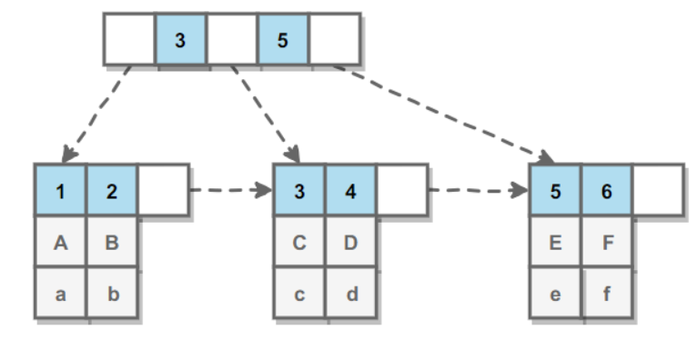
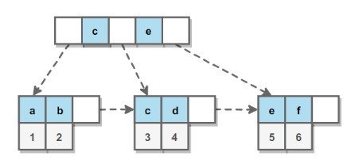

# mysql

# 目录
- # [MySQL 索引](MySQL&emsp;索引)
  - [1. B+Tree 索引](#&emsp;B+Tree&emsp;索引)
  - [2. 哈希索引](#2.&emsp;哈希索引)
  - [2. 哈希索引](#2.&emsp;哈希索引)
- # [索引优化](#索引优化)  
  - [1. 独立的列](1.&emsp;独立的列)
  - [2. 多列索引](2.&emsp;多列索引)
  - [3. 索引列的顺序](3.&emsp;索引列的顺序)
  - [4. 前缀索引](4.&emsp;前缀索引)
- # [索引的优点](#索引的优点)
- # [索引的使用条件](#索引的使用条件)
- # [查询性能优化](#查询性能优化)
  
# MySQL 索引
索引是在存储引擎层实现的，而不是在服务器层实现的，所以不同存储引擎具有不同的索引类型和实现。

**1. B+Tree 索引**
是大多数 MySQL 存储引擎的默认索引类型。

因为不再需要进行全表扫描，只需要对树进行搜索即可，所以查找速度快很多。

因为 B+ Tree 的有序性，所以除了用于查找，还可以用于排序和分组。

可以指定多个列作为索引列，多个索引列共同组成键。

适用于全键值、键值范围和键前缀查找，其中键前缀查找只适用于最左前缀查找。如果不是按照索引列的顺序进行查找，则无法使用索引。

InnoDB 的 B+Tree 索引分为主索引和辅助索引。主索引的叶子节点 data 域记录着完整的数据记录，这种索引方式被称为聚簇索引。因为无法把数据行存放在两个不同的地方，所以一个表只能有一个聚簇索引。

辅助索引的叶子节点的 data 域记录着主键的值，因此在使用辅助索引进行**查找**时，需要先查找到**主键值**，然后再到**主索引**中进行查找。



**2. 哈希索引**
失去了有序性：
* 无法用于排序与分组；
* 只支持精确查找，无法用于部分查找和范围查找。

# [索引优化](#索引优化)
**1. 独立的列**

在进行查询时，索引列不能是**表达式的一部分**，也不能是**函数的参数**，否则无法使用索引。

例如下面的查询不能使用 actor_id 列的索引：
```sql
SELECT actor_id FROM sakila.actor WHERE actor_id + 1 = 5;
```
**2. 多列索引**

* 多列索引
```sql
CREATE TABLE test (  
    id         INT NOT NULL,  
    last_name  CHAR(30) NOT NULL,  
    first_name CHAR(30) NOT NULL,  
    PRIMARY KEY (id),  
    INDEX name (last_name,first_name)  
);  
```
* 单个多列索引
```sql
CREATE TABLE test (  
    id         INT NOT NULL,  
    last_name  CHAR(30) NOT NULL,  
    first_name CHAR(30) NOT NULL,  
    PRIMARY KEY (id),  
    INDEX name (last_name),  
     INDEX_2 name (first_name)  
);  
```

在需要使用多个列作为条件进行查询时，使用**多列索引**比使用**多个单列索引**性能更好。

例如下面的语句中，最好把 actor_id 和 film_id 设置为多列索引。
```sql
SELECT film_id, actor_ id FROM sakila.film_actor
WHERE actor_id = 1 AND film_id = 1;
```
**3. 索引列的顺序**
- 让**选择性最强**的索引列放在前面。
- **索引的选择性是指**：不重复的索引值和记录总数的比值。最大值为 1，此时每个记录都有唯一的索引与其对应。选择性越高，每个记录的区分度越高，查询效率也越高。
```sql
SELECT COUNT(DISTINCT staff_id)/COUNT(*) AS staff_id_selectivity,
COUNT(DISTINCT customer_id)/COUNT(*) AS customer_id_selectivity,
COUNT(*)
FROM payment;
```
```sql
   staff_id_selectivity: 0.0001
customer_id_selectivity: 0.0373
               COUNT(*): 16049
```
**4. 前缀索引**
当索引是很长的字符序列时，这个索引将会很占内存，而且会很慢，这时候就会用到前缀索引了。所谓的前缀索引就是去索引的前面几个字母作为索引，但是要降低索引的重复率，索引我们还必须要判断前缀索引的重复率。先看这样一张表：
```sql

mysql> select * from test;
+----------+-------+
| name     | score |
+----------+-------+
| zhangsan | 123   |
| wangwu   | 345   |
| zhaoliu  | 234   |
| lisisi   | 687   |
+----------+-------+
4 rows in set (0.08 sec)
```
如果以name作为索引，当name对应的字符串很长时，就要考虑索引的占用空间和效率问题。这时候就需要引入前缀索引，在使用前缀索引时，首先要去比较重复率。
```sql

mysql> select 1.0*count(distinct name)/count(*) from test;
+-----------------------------------+
| 1.0*count(distinct name)/count(*) |
+-----------------------------------+
|                           1.00000 |
+-----------------------------------+
1 row in set (0.00 sec)
 
mysql> select 1.0*count(distinct left(name,2))/count(*) from test;
+-------------------------------------------+
| 1.0*count(distinct left(name,2))/count(*) |
+-------------------------------------------+
|                                   0.75000 |
+-------------------------------------------+
1 row in set (0.00 sec)
 
mysql> select 1.0*count(distinct left(name,1))/count(*) from test;
+-------------------------------------------+
| 1.0*count(distinct left(name,1))/count(*) |
+-------------------------------------------+
|                                   0.75000 |
+-------------------------------------------+
1 row in set (0.00 sec)
 
mysql> select 1.0*count(distinct left(name,3))/count(*) from test;
+-------------------------------------------+
| 1.0*count(distinct left(name,3))/count(*) |
+-------------------------------------------+
|                                   0.75000 |
+-------------------------------------------+
1 row in set (0.00 sec)
 
mysql> select 1.0*count(distinct left(name,4))/count(*) from test;
+-------------------------------------------+
| 1.0*count(distinct left(name,4))/count(*) |
+-------------------------------------------+
|                                   1.00000 |
+-------------------------------------------+
1 row in set (0.00 sec)
 
mysql> select 1.0*count(distinct left(name,2))/count(*) from test;
+-------------------------------------------+
| 1.0*count(distinct left(name,2))/count(*) |
+-------------------------------------------+
|                                   0.75000 |
+-------------------------------------------+
1 row in set (0.00 sec)
 
mysql> select 1.0*count(distinct left(name,5))/count(*) from test;
+-------------------------------------------+
| 1.0*count(distinct left(name,5))/count(*) |
+-------------------------------------------+
|                                   1.00000 |
+-------------------------------------------+
1 row in set (0.00 sec)
```
其中left函数为字符串截取函数。

select 1.0*count(distinct name)/count(*) from test这是比较整个name的重复率，当时这是最好的情况。然后分别截取name字符的前几个字母，最后选取的计算值要接近整个取整个name时得出的计算值，然后再选中占用空间小的。由上面执行的结果可知应选中name的前4个字母作为索引最为适合
```sql
mysql> alter table test add key(name(4));
Query OK, 4 rows affected (0.15 sec)
Records: 4  Duplicates: 0  Warnings: 0
```
* 要取得设置前缀索引最理想的`"prefix_length"`，我们首先要取得整列的选择性，如下：

`SELECT COUNT(DISTINCT family_name)/COUNT(*) FROM user;`
假设这里得到值是`0.188`。
然后我们继续去看看该列前1个字符的选择性又是多少

`SELECT COUNT(DISTINCT LEFT(family_name,1))/COUNT(*) FROM user;`
假设这里得到的结果是0.532，和整列的选择性出入太大，不可取，继续：

`SELECT COUNT(DISTINCT LEFT(family_name,2))/COUNT(*) FROM user;`
`SELECT COUNT(DISTINCT LEFT(family_name,3))/COUNT(*) FROM user;`

假设直接到`“prefix_length”`为5时，得到的值为`0.189`，非常接近！
而取6时得到的值为`0.18891`，这个选择性和5并没有太大的偏差。
再结合减少索引文件大小的这个思路
`“prefix_length”`值设置为5才是此处设置前缀索引的最优方案！
选择性讲完，还得再讲清楚这个前缀索引该怎么用！

# **索引的优点**
* 大大减少了服务器需要扫描的数据行数。
* 帮助服务器避免进行排序和分组，以及避免创建临时表（B+Tree 索引是有序的，可以用于 ORDER BY 和 GROUP BY 操作。临时表主要是在排序和分组过程中创建，不需要排序和分组，也就不需要创建临时表）。
* 将随机 I/O 变为顺序 I/O（B+Tree 索引是有序的，会将相邻的数据都存储在一起）。

# **索引的使用条件**
* 对于非常小的表、大部分情况下简单的全表扫描比建立索引更高效；
* 对于中到大型的表，索引就非常有效；
* 但是对于特大型的表，建立和维护索引的代价将会随之增长。这种情况下，需要用到一种技术可以直接区分出需要查询的一组数据，而不是一条记录一条记录地匹配，例如可以使用分区技术。

# **查询性能优化**

# [优化数据访问](#优化数据访问)
**1. 减少请求的数据量**
* 只返回必要的列：最好不要使用 SELECT * 语句。
* 只返回必要的行：使用 LIMIT 语句来限制返回的数据。
* 缓存重复查询的数据：使用缓存可以避免在数据库中进行查询，特别在要查询的数据经常被重复查询时，缓存带来的查询性能提升将会是非常明显的。

**2. 减少服务器端扫描的行数**
* 最有效的方式是使用索引来覆盖查询。

**使用 Explain 进行分析**

Explain 用来分析 SELECT 查询语句，开发人员可以通过分析 Explain 结果来优化查询语句。

* select_type : 查询类型，有简单查询、联合查询、子查询等
* key : 使用的索引
* rows : 扫描的行数

# **重构查询方式**

**1. 切分大查询**

一个大查询如果一次性执行的话，可能一次锁住很多数据、占满整个事务日志、耗尽系统资源、阻塞很多小的但重要的查询。
```sql
DELETE FROM messages WHERE create < DATE_SUB(NOW(), INTERVAL 3 MONTH);

rows_affected = 0
do {
    rows_affected = do_query(
    "DELETE FROM messages WHERE create  < DATE_SUB(NOW(), INTERVAL 3 MONTH) LIMIT 10000")
} while rows_affected > 0
```
**2. 分解大连接查询**

将一个大连接查询分解成对每一个表进行一次单表查询，然后在应用程序中进行关联，这样做的好处有：

* 让缓存更高效。对于连接查询，如果其中一个表发生变化，那么整个查询缓存就无法使用。而分解后的多个查询，即使其中一个表发生变化，对其它表的查询缓存依然可以使用。
* 分解成多个单表查询，这些单表查询的缓存结果更可能被其它查询使用到，从而减少冗余记录的查询。
减少锁竞争；
* 在应用层进行连接，可以更容易对数据库进行拆分，从而更容易做到高性能和可伸缩。
* 查询本身效率也可能会有所提升。例如下面的例子中，使用 IN() 代替连接查询，可以让 MySQL 按照 ID 顺序进行查询，这可能比随机的连接要更高效。
   
   
   
  


